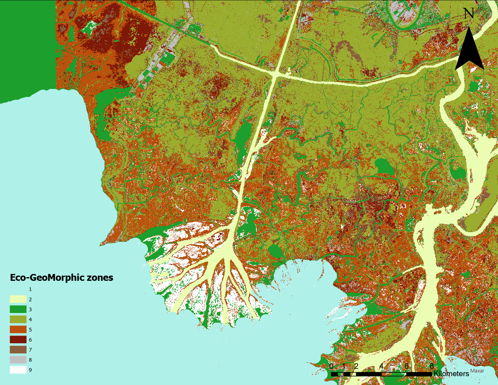
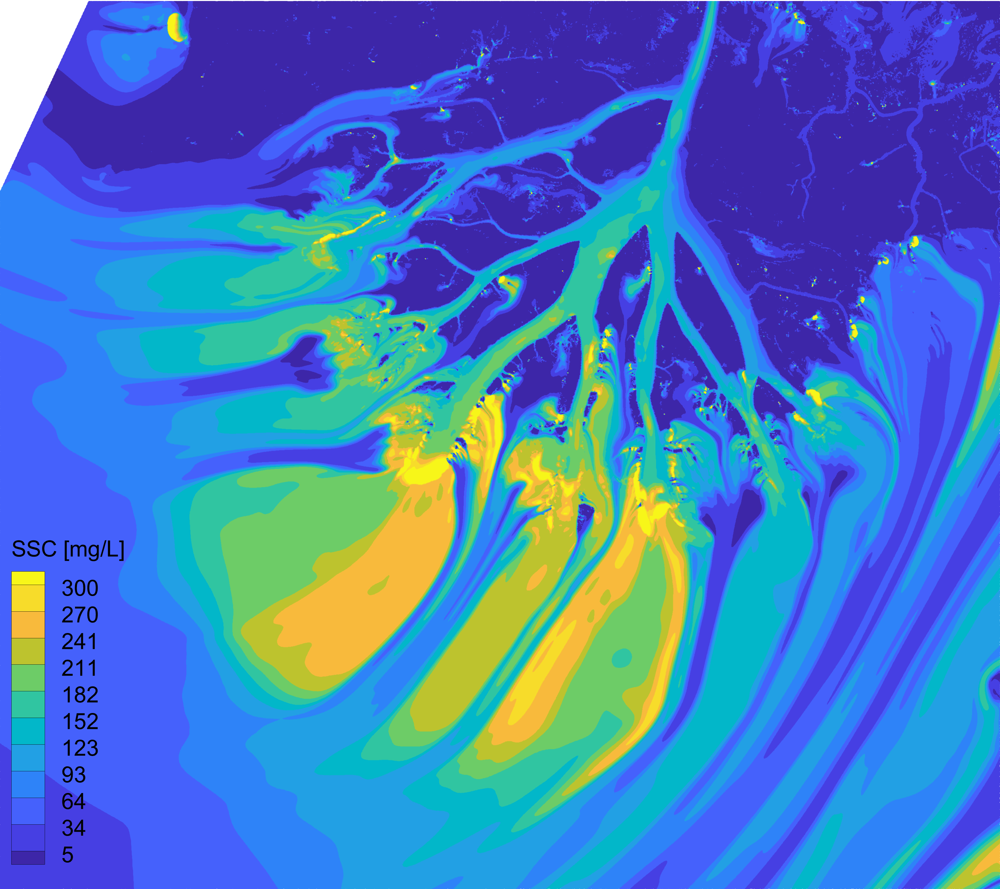
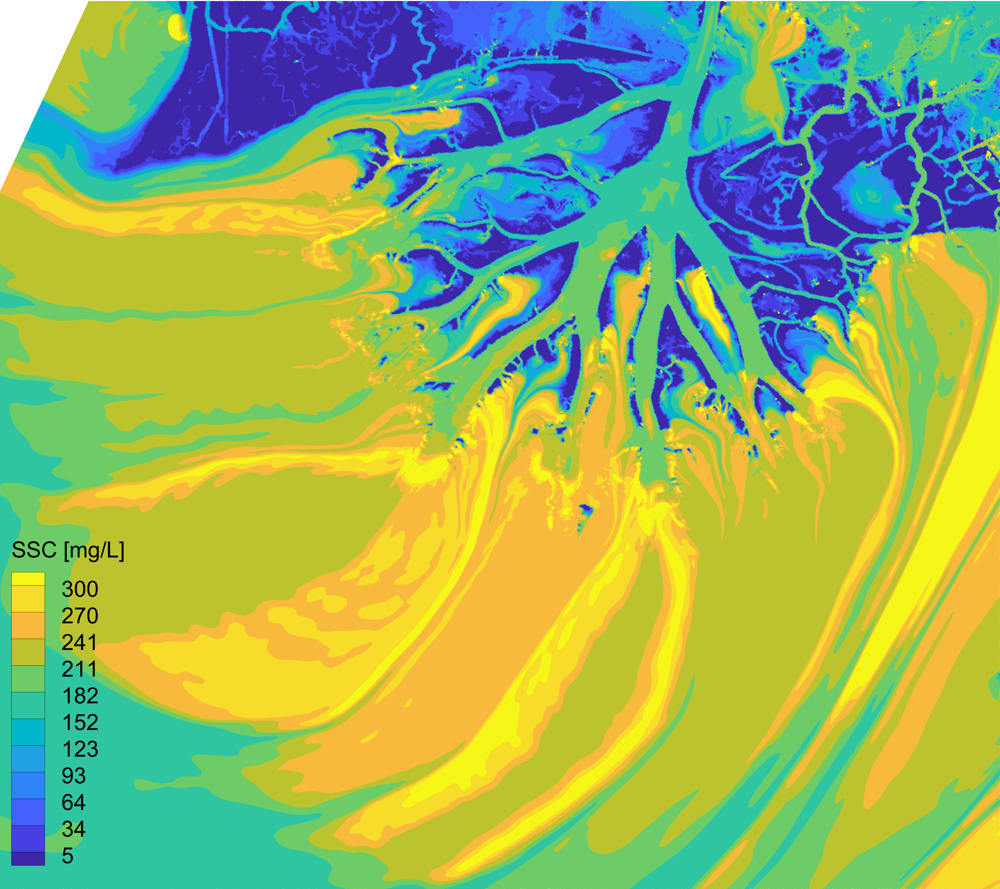
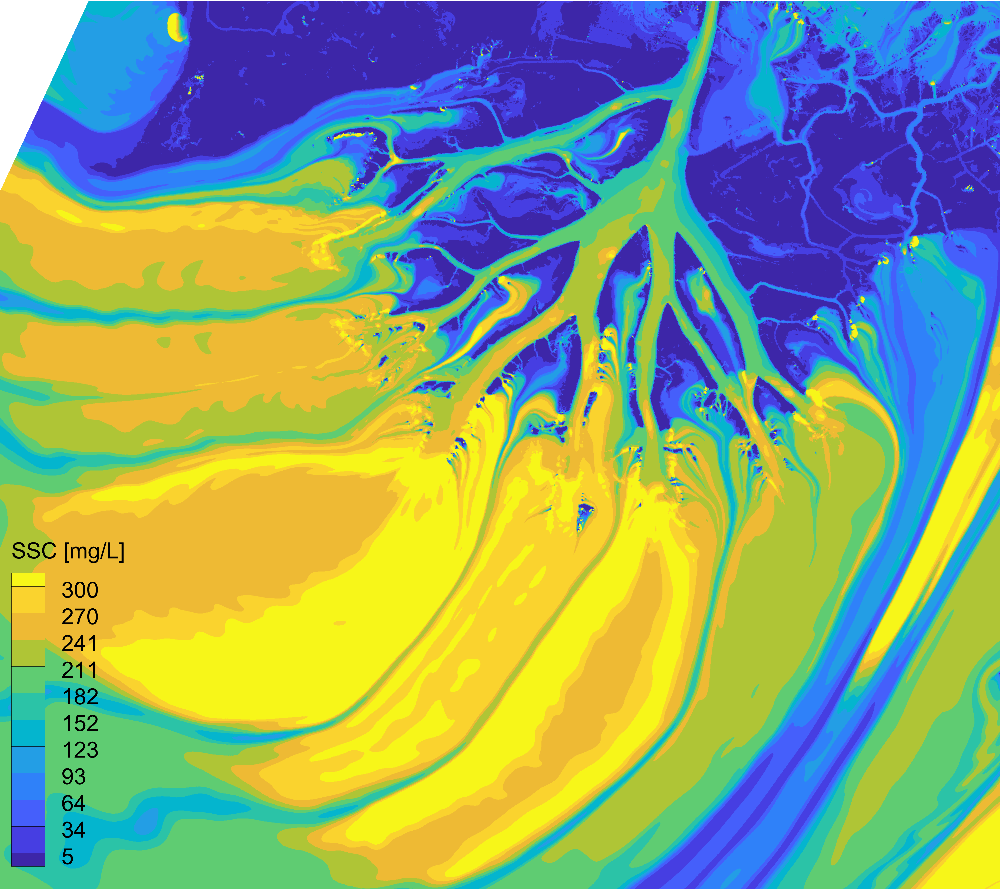

# openTelemac River Delta Model

## Overview
This repository contains the openTelemac model code for simulating the hydrodynamics and suspended sediment transport in Wax Lake Delta and Atchafalaya Delta with the implementation of eco-geomorphic zones and DeLeeuw et al. (2020) entrainment relations. The model aims to introduce three different ways to model mud or cohesive sediments: the classic theory, the non-cohesive theory, and the non-cohesive theory with effective Rouse profiles. The goal of developing this model is to provide insights into suspended sediment transport in freshwater systems employing the effective floc theory, hence using these theories to study river-dominated delta formation, evolution, and the impact of various environmental factors.

openTelemac is an integrated suite of solvers for free-surface environmental flow, sediment transport, morphodynamics, waves, and water quality. It has been widely utilized in studies across different scales, from global ocean currents models to local high-resolution models. The code is developed and managed by Saint Venant Hydraulics Lab, under the EDF and École des Ponts ParisTech. The open-source approach allows anyone to take advantage of openTelemac and assess its performance.

## Model Solvers
- **Telemac2D**: This hydrodynamics solver is used to solve shallow water equations and incorporates a kappa-epsilon turbulence closure model. It is designed to simulate depth-averaged equations in two dimensions, which is essential for understanding the flow hydrodynamics at river deltas. This solver also solves the transport equations for suspended sediment concentration while coupling with sediment transport solver GAIA.
- **GAIA**: As the sediment transport solver, GAIA solves the Exner equation, calculates entrainment flux, and depositional flux, and evolves morphodynamics. It is crucial for predicting sediment deposition and erosion patterns, which are key to modeling the evolution of river deltas.

## Features
- **Hydrodynamic Simulation**: Utilizes Telemac2D to model water flow dynamics with turbulence closure.
- **Sediment Transport**: Employs GAIA for simulating erosion and deposition processes.
- **Implementations**: This model implemented De Leeuw et al. (2020) entrainment relation to model both sand and mud entrainments. Eco-geomorphic zones are also implemented along with Baptist vegetation resistance relations to model the complex flow over the wetland and river network. 
- **High-Resolution Delta Evolution Model**: Models the long-term evolution of river deltas under different scenarios. The resolution used in this model is around 10m over the entire study domain (~2000 sq. km). It is run on the NSF Flagship supercomputer Frontera.


## Installation
To use this model, please ensure you have openTelemac installed on your system. The installation guide can be found on the [openTelemac website](http://wiki.opentelemac.org/doku.php?id=installation_notes_2_beta).
**This model is compiled and run in Linux system using Intel oneAPI High-Performance Computing (HPC) compiler**. For more details on the Intel HPC compiler please visit its [website](https://www.intel.com/content/www/us/en/developer/tools/oneapi/dpc-compiler.html#gs.6lr3f5).

1. Clone the repository:
```markdown
   git clone https://github.com/dwang53/WaxLakeDelta_openTelemac_model.git
   ```
2. Navigate to the model directory:
   ```
   cd WaxLakeDelta_openTelemac_model
   ```
3. Copy the mesh files into CaseFile folder:
   ```
   cp ../Mesh/* .
   ```
4. Run the simulation using the provided scripts:
   ```
   source runcode.sh
   ```

## Theoretical Background

### Shallow Water Equations in Telemac2D
The Telemac2D module within the openTelemac system is designed to solve the two-dimensional shallow water equations, which are a set of hyperbolic partial differential equations (PDEs) that describe fluid flow below a pressure surface in a body of water. These equations are derived from the conservation of mass and momentum (the Navier-Stokes equations) under the assumption that the horizontal length scales are much greater than the vertical length scale. Mathematically, the shallow water equations can be expressed as:

$$
\begin{aligned}
&\frac{\partial h}{\partial t} + \frac{\partial (hu)}{\partial x} + \frac{\partial (hv)}{\partial y} = 0, \\
&\frac{\partial (hu)}{\partial t} + \frac{\partial}{\partial x}(hu^2 + \frac{1}{2}gh^2) + \frac{\partial (huv)}{\partial y} = -gh\frac{\partial z_b}{\partial x} + S_{fx}, \\
&\frac{\partial (hv)}{\partial t} + \frac{\partial (huv)}{\partial x} + \frac{\partial}{\partial y}(hv^2 + \frac{1}{2}gh^2) = -gh\frac{\partial z_b}{\partial y} + S_{fy},
\end{aligned}
$$

where \( h \) is the water depth, \( u \) and \( v \) are the flow velocities in the \( x \) and \( y \) directions, respectively, \( g \) is the acceleration due to gravity, \( z_b \) is the bed elevation, and \( S_{fx} \), \( S_{fy} \) are the friction source terms in the \( x \) and \( y \) directions.

### Kappa-Epsilon Turbulence Closure in Telemac2D
The kappa-epsilon (k-ε) turbulence model is used in Telemac2D to simulate the effects of turbulence within the flow. This model is a two-equation model where the transport equations for the turbulent kinetic energy (k) and its dissipation rate (ε) are solved alongside the shallow water equations. The model equations are:

$$
\begin{aligned}
&\frac{\partial k}{\partial t} + u\frac{\partial k}{\partial x} + v\frac{\partial k}{\partial y} = P_k - \epsilon + \frac{\partial}{\partial x}\left(\nu_t\frac{\partial k}{\partial x}\right) + \frac{\partial}{\partial y}\left(\nu_t\frac{\partial k}{\partial y}\right), \\
&\frac{\partial \epsilon}{\partial t} + u\frac{\partial \epsilon}{\partial x} + v\frac{\partial \epsilon}{\partial y} = \frac{\epsilon}{k}(C_{1\epsilon}P_k - C_{2\epsilon}\epsilon) + \frac{\partial}{\partial x}\left(\nu_t\frac{\partial \epsilon}{\partial x}\right) + \frac{\partial}{\partial y}\left(\nu_t\frac{\partial \epsilon}{\partial y}\right),
\end{aligned}
$$

where \( P_k \) is the production of turbulent kinetic energy, \( \nu_t \) is the eddy viscosity, and \( C_{1\epsilon} \), \( C_{2\epsilon} \) are model constants.

### Exner Equation for Sediment Transport
The sediment transport within the model is governed by the Exner equation, which is a statement of conservation of mass for sediment particles. In this model, the Exner equation is solved in terms of the entrainment flux (\( E \)) and the depositional flux (\( D \)) of suspended sediment concentration. This formulation allows for a detailed representation of the sediment dynamics as it accounts for the rate at which sediment is incorporated into the flow (entrainment) and the rate at which it settles back onto the bed (deposition). The Exner equation in this context is given by:

$$
\frac{\partial z_b}{\partial t} = -\frac{1}{(1 - \lambda_p)}(E - D),
$$

where \( z_b \) is the bed elevation, \( \lambda_p \) is the bed porosity, \( E \) is the entrainment flux, and \( D \) is the depositional flux.

The entrainment flux \( E \) can be described as a function of the flow shear stress and the properties of the bed material, while the depositional flux \( D \) is related to the settling velocity of the sediment particles and the suspended sediment concentration. Together, these fluxes determine the net rate of change in the bed elevation due to sediment transport.


### Depth-Averaged Advection-Diffusion Equation for Suspended Sediment Transport
The transport of suspended sediment concentration in the model is described by a depth-averaged advection-diffusion equation. This simplification reduces the complexity of the three-dimensional transport equation to two dimensions, making it more tractable for numerical simulation while still capturing the essential physics of sediment transport. The depth-averaged equation is given by:

$$
\frac{\partial (\bar{C} H)}{\partial t} + \nabla_h \cdot (\bar{C} H \mathbf{u}) = \nabla_h \cdot (k H \nabla_h \bar{C}) + E - D,
$$

where \( \bar{C} \) is the depth-averaged suspended sediment concentration, \( H \) is the total water depth, \( \mathbf{u} \) is the depth-averaged velocity vector, \( k \) is the depth-averaged diffusion coefficient, \( E \) represents the entrainment flux, and \( D \) represents the depositional flux.

In this equation, the term \( \nabla_h \cdot (\bar{C} H \mathbf{u}) \) represents the advection of sediment by the flow, \( \nabla_h \cdot (k H \nabla_h \bar{C}) \) represents the diffusion of sediment due to turbulence, and \( E - D \) accounts for the net change in sediment concentration due to entrainment and deposition processes.

### Implementation of De Leeuw et al. (2020) entrainment formula 
In this model case, we implemented the De Leeuw et al. (2020) entrainment formula to model the suspended sediment transport for both non-cohesive sediment, such as sand, and flocculated cohesive sediment, the mud. The De Leeuw paper proposed a new entrainment relation for non-cohesive sediments (sand and gravel) based on a global data compilation from sand-bed rivers. Our previous study found that mud particles flocculate and form aggregates during the transport process, causing the mud transport to behave similarly to larger non-cohesive sediment grains. De Leeuw's formula is found to be extendable and suitable for describing mud transport behavior when employing the concept of effective settling velocity. In all the tested scenarios, the De Leeuw relation is used for sand entrainment, while the entrainment relation for mud is adjusted.

$$
E=A(\frac{u_*}{w_s})^{\alpha}Fr^{\beta}
$$


## Eco-GeoMorphic zones
This model implements the Eco-GeoMorphic zones, which are derived from remote sensing data of vegetation types. There are a total of 9 categories of land surface types. Each zone uses different friction coefficients. The vegetation types are modeled by employing the Baptist et al. (2007) vegetation friction formula and variable coefficients. These zones are shown in the figure below.



## Model results
By changing the variables in the steering files, this model is used to test three different frameworks for modeling mud transport processes: (i) the non-cohesive theory and De Leeuw entrainment relation with effective settling velocities, (ii) the classic transport theory of mud, and (iii) the non-cohesive theory with De Leeuw entrainment relations. We found that the first method provides the best results when compared with the AVIRIS-NG derived suspended sediment data, without the need for extensive calibration iterations. The classic theory requires costly trial-and-error calibration, yet the results are still not fully satisfying. The third method yields the worst results due to the unrealistically high entrainment rate predicted by the non-cohesive De Leeuw formula.

<figure>
  <table>
    <tr>
      <td>
        <figure>
          
          <figcaption>De Leeuw entrainment and non-cohesive theory w/ effective settling velocity</figcaption>
        </figure>
      </td>
      <td>
        <figure>
          
          <figcaption>Classic theory of mud transport</figcaption>
        </figure>
      </td>
      <td>
        <figure>
          
          <figcaption>De Leeuw entrainment and non-cohesive theory</figcaption>
        </figure>
      </td>
    </tr>
  </table>
   <figcaption>De Leeuw theory and non-cohesive theory w/ effective settling velocity</figcaption>
</figure>


## List of files
| File Type | Description | Location |
|-----------|-------------|----------|
| `.cas` | Steering files for Telemac2D and GAIA, containing all parameters and model settings. | `CaseFile/` |
| `.slf` | Binary mesh file used by the model. | `Mesh/` |
| `.cli` | Mesh boundary condition file. | `Mesh/` |
| `.liq` | Liquid boundary time series file. | `CaseFile/` |
| `.tbl` | Defines friction and constants in vegetation model across different eco-geomorphic zones. | `CaseFile/` |
| Folder | Contains modified model code. | `CaseFile/user_fortran/` |


## Contributing
Contributions to the openTelemac River Delta Model are welcome. Please read [CONTRIBUTING](CONTRIBUTING) for details on our code of conduct, and the process for submitting pull requests.

## License
This project is licensed under the MIT License - see the [LICENSE](LICENSE) file for details.

## Acknowledgments
- funding source Delta-X, NSF floc project

## Contact
For any queries or collaboration opportunities, please contact the repository owner at `dwang53@caltech.edu`.

## References
- Please cite the following papers when using this model:
  - [Wang, D., et al., Year, "Title of the Paper", Journal Name, Volume(Issue), Pages.](link_to_paper)
  - [Baptist, M. J., Babovic, V., Rodríguez Uthurburu, J., Keijzer, M., Uittenbogaard, R. E., Mynett, A., & Verwey, A. (2007). On inducing equations for vegetation resistance. Journal of Hydraulic Research, 45(4), 435-450.](https://www.tandfonline.com/doi/abs/10.1080/00221686.2007.9521778)
  - [De Leeuw, J., Lamb, M. P., Parker, G., Moodie, A. J., Haught, D., Venditti, J. G., & Nittrouer, J. A. (2020). Entrainment and suspension of sand and gravel. Earth Surface Dynamics, 8(2), 485-504.](https://esurf.copernicus.org/articles/8/485/2020/)

